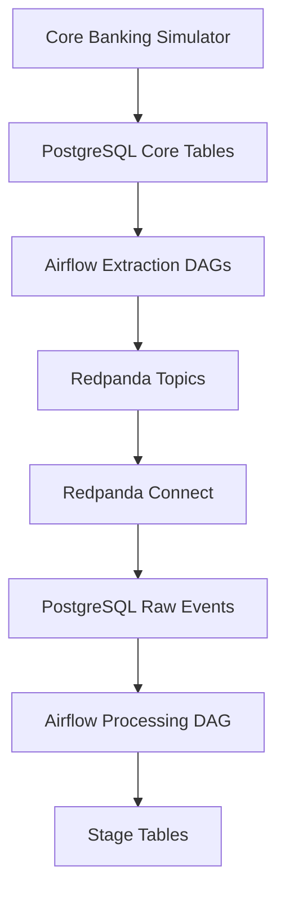

# Core Banking Event-Driven Data Pipeline

An event-driven data engineering project that simulates Core Banking activity and processes banking events using Apache Airflow, PostgreSQL, Redpanda, Redpanda Connect, Python, and Docker.

## Overview

This project demonstrates a complete local banking data pipeline:

- Generates synthetic transactions, payments, and credit records
- Stores operational data in PostgreSQL
- Extracts new records incrementally with Apache Airflow
- Publishes events to Kafka-compatible Redpanda topics
- Loads events into a raw data layer
- Transforms raw events into structured staging tables
- Orchestrates the complete workflow through a central Airflow DAG

All generated banking data is fictional.

## Architecture



## Technology Stack

| Component | Purpose |
|---|---|
| Python | Synthetic Core Banking data generation |
| PostgreSQL | Operational, raw, and staging data storage |
| Apache Airflow | Extraction, processing, and orchestration |
| Redpanda | Kafka-compatible event-streaming platform |
| Redpanda Connect | Streaming events into the raw data layer |
| Docker Compose | Local infrastructure orchestration |

## Airflow DAGs

| DAG | Responsibility |
|---|---|
| `extract_core_transactions` | Extract new transaction records |
| `extract_core_payments` | Extract new payment records |
| `extract_core_credit` | Extract new credit records |
| `process_kafka_raw_events` | Transform raw events into staging tables |
| `main_core_banking_pipeline` | Coordinate the complete pipeline |

## Pipeline Workflow

1. The simulator inserts synthetic records into the Core Banking source tables.
2. Three Airflow extraction DAGs read new records incrementally.
3. Extracted records are published as events to Redpanda topics.
4. Redpanda Connect transfers the events into `public.raw_events`.
5. The processing DAG validates and transforms the raw events.
6. Processed records are loaded into staging tables.
7. The main orchestration DAG coordinates all pipeline tasks.

## Project Structure

```text
core-banking-event-driven-pipeline/
|
|-- dags/
|   |-- extract_core_transactions.py
|   |-- extract_core_payments.py
|   |-- extract_core_credit.py
|   |-- process_kafka_raw_events.py
|   `-- main_core_banking_pipeline.py
|
|-- simulator/
|   `-- core_banking_simulator.py
|
|-- sql/
|-- redpanda-connect/
|-- docker-compose.yml
|-- .gitignore
`-- README.md
```

## Running the Simulator

Generate one transaction, one payment, and one credit record:

```powershell
python simulator/core_banking_simulator.py --once
```

Run continuously and generate one random event every five seconds:

```powershell
python simulator/core_banking_simulator.py --interval 5
```

Generate multiple events per interval:

```powershell
python simulator/core_banking_simulator.py --interval 5 --burst 10
```

## Environment Variables

The simulator supports the following environment variables:

```text
CORE_DB_HOST
CORE_DB_PORT
CORE_DB_NAME
CORE_DB_USER
CORE_DB_PASSWORD
```

Default values are configured for local demonstration only.

## Key Design Concepts

- Event-driven architecture
- Incremental data extraction
- Kafka-compatible event streaming
- Raw and staging data layers
- Workflow orchestration
- Watermark-based processing
- Containerized local infrastructure
- Synthetic banking data generation

## Disclaimer

This project is intended only for learning, development, and architecture demonstration.

It does not contain real customer information, production credentials, or proprietary banking data.